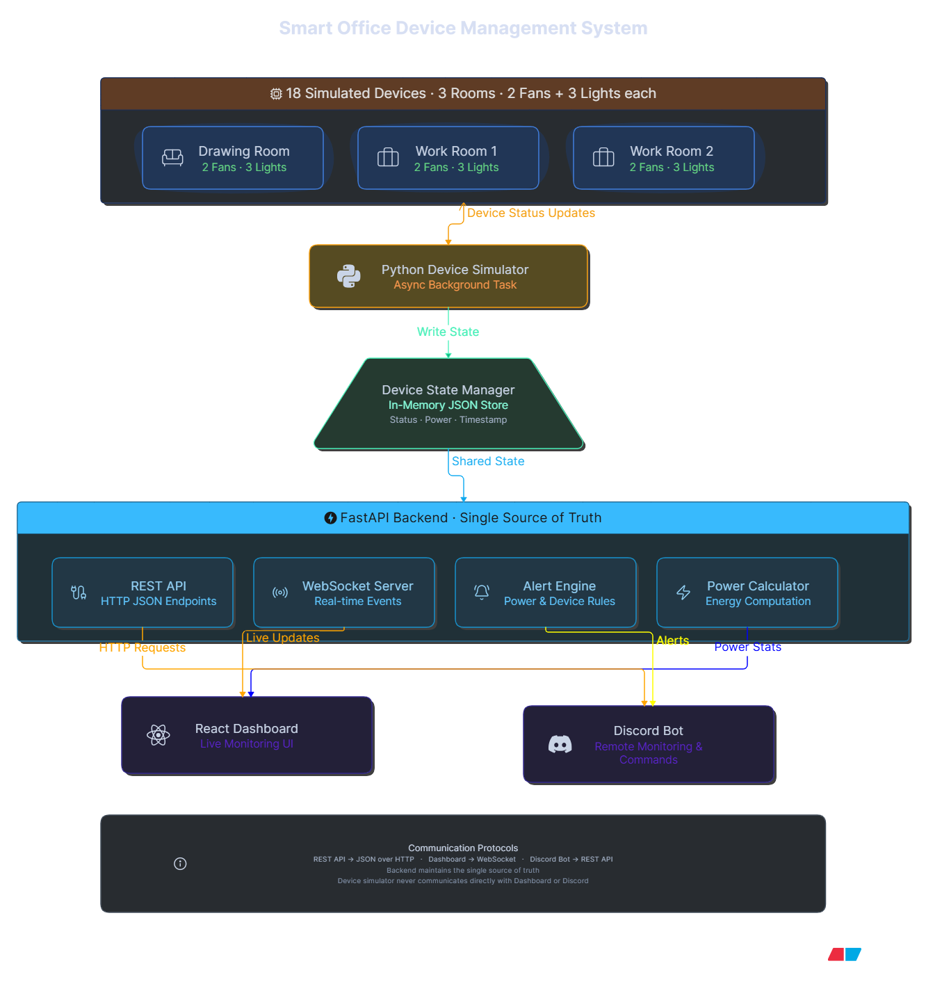

# 🏢 Smart Office Device Management System

A real-time Smart Office Monitoring System built for the **IUT CSE TechFest 2026 Hackathon**.

The project simulates and monitors an office environment using a centralized **FastAPI** backend. It provides live monitoring through a **React Dashboard**, **Discord Bot**, and **ESP32 IoT devices**, ensuring all clients always reflect the same device state.

---

# 📌 Features

---

# 🏗 System Architecture

<p align="center">

</p>

---

## 🌐 Backend

- ⚡ FastAPI REST API
- 🔄 Real-time WebSocket Communication
- 📡 Centralized Device State Manager
- ⚙️ In-Memory Device Store
- 📈 Runtime & Energy Calculation
- 📊 Live Power Monitoring
- 🔌 ESP32 Ready API

---

## 🖥 React Dashboard

- 🏢 Interactive Office Floor Layout
- 💡 Live Light Status
- 🌀 Live Fan Status
- 🚪 Door Monitoring
- ⚡ Current Power Consumption
- 🔋 Daily Energy Usage
- 📈 Room-wise Statistics
- 🔄 Real-time WebSocket Updates

---

# 🏗 Dashboard Live

<p align="center">

</p>

---
## 🤖 Discord Bot

The Discord bot communicates directly with the FastAPI backend and provides real-time office monitoring from any Discord server.

### Supported Slash Commands

| Command | Description |
|----------|-------------|
| `/devices` | Show all office devices |
| `/device <id>` | Show a specific device |
| `/status` | Office status grouped by room |
| `/room <room>` | Status of a specific room |
| `/usage` | Room-wise energy usage |
| `/power` | Current office power |
| `/summary` | Office overview |
| `/on <id>` | Turn ON a device |
| `/off <id>` | Turn OFF a device |
| `/toggle <id>` | Toggle a device |

### 🚨 Automatic Alert System

The bot automatically checks the office after working hours.

If devices remain ON after office hours, it posts a reminder inside a designated Discord channel.

Example

```text
⚠️ Office Reminder

🏢 Work Room 2

🌀 Fans ON : 2
💡 Lights ON : 3

🕙 It's already after 10 PM.

Did someone forget to switch them off?
```
---

# 🏗 OFFICEBOT DISCORD

<p align="center">

</p>

---

## 🔌 IoT Integration

- ESP32 Compatible
- HTTP Device Control
- JSON Communication
- Cloud Accessible REST API
- Wokwi Simulation Support

---

# 🏗 ESP32 Architecture Using WOKWI

<p align="center">

</p>

---

# 🔄 Data Flow

```text
             ESP32 Devices
                   │
              HTTP Requests
                   │
                   ▼
          FastAPI Backend
                   │
        Device State Manager
       (Single Source of Truth)
                   │
      ┌────────────┼──────────────┐
      │            │              │
      ▼            ▼              ▼
 REST API     WebSocket      Alert Engine
      │            │              │
      ▼            ▼              ▼
React Dashboard  Live UI    Discord Bot
```

---

# 🏢 Office Layout

The simulated office contains **18 Smart Devices** distributed across **3 Rooms**.

| Room | Devices |
|------|----------|
| Drawing Room | 2 Fans · 3 Lights · 1 Door |
| Work Room 1 | 2 Fans · 3 Lights · 1 Door |
| Work Room 2 | 2 Fans · 3 Lights · 1 Door |

### Total Devices

- 🌀 Fans : **6**
- 💡 Lights : **9**
- 🚪 Doors : **3**

**Total = 18 Smart Devices**

---

# 📊 Device Statistics

Each device stores

- Current Status
- Rated Power
- Current Power
- Runtime
- Daily Energy Usage
- Last Updated Timestamp

---

# ⚙ Backend API

Built with **FastAPI**

## REST Endpoints

| Method | Endpoint | Description |
|---------|----------|-------------|
| GET | `/devices` | Get all devices |
| GET | `/devices/{id}` | Get a specific device |
| POST | `/devices/{id}` | Update device state |
| WS | `/ws` | Live WebSocket |

---

# 🔌 ESP32 Communication

ESP32 devices communicate directly with the backend using HTTP.

Example

```http
POST /devices/5
```

```json
{
    "status": true
}
```

Once updated, the backend

- Updates the device state
- Recalculates runtime
- Recalculates power
- Recalculates energy
- Broadcasts via WebSocket
- Updates every connected dashboard
- Updates Discord Bot responses

---

# 🤖 Discord Commands Preview

```text
/devices
/device 5
/status
/room work1
/usage
/power
/summary
/on 5
/off 5
/toggle 5
```

---

# 📂 Project Structure

```text
Smart-Office-System
│
├── backend
│   ├── app
│   │   ├── api
│   │   ├── core
│   │   ├── data
│   │   ├── services
│   │   ├── simulator
│   │   ├── websocket
│   │   └── main.py
│   │
│   └── requirements.txt
│
├── frontend
│   ├── src
│   ├── public
│   └── package.json
│
├── discord_bot
│   ├── api.py
│   ├── bot.py
│   ├── config.py
│   ├── requirements.txt
│   └── .env
│
├── docs
│   └── system-architecture.png
│
└── README.md
```

---

# 🚀 Technologies Used

## Backend

- FastAPI
- Uvicorn
- WebSocket
- Pydantic
- Python

## Frontend

- React
- Vite
- Tailwind CSS
- Axios
- React Router

## Discord Bot

- discord.py
- Requests
- python-dotenv

## IoT

- ESP32
- Arduino
- ArduinoJson
- HTTPClient
- Wokwi

---

# ✅ Current Progress

| Module | Status |
|---------|--------|
| Project Planning | ✅ |
| Device Dataset | ✅ |
| Device State Manager | ✅ |
| REST API | ✅ |
| WebSocket | ✅ |
| React Dashboard | ✅ |
| Office Layout | ✅ |
| Live Activity Feed | ✅ |
| Runtime Calculation | ✅ |
| Power Monitoring | ✅ |
| Energy Monitoring | ✅ |
| ESP32 Integration | ✅ |
| Discord Bot | ✅ |
| Slash Commands | ✅ |
| Automatic Alert System | ✅ |
| Authentication | ⏳ |
| Database | ⏳ |
| MQTT Support | ⏳ |

---

# 🔮 Future Improvements

- MQTT Communication
- PostgreSQL Database
- User Authentication
- Role-based Access
- Historical Analytics
- Device Scheduling
- AI-powered Energy Recommendations
- Predictive Energy Consumption
- Mobile Responsive Dashboard
- Physical ESP32 Deployment
- Cloud Deployment

---

# 👨‍💻 Developed For

**IUT CSE TechFest 2026 Hackathon**

**Team Project — Smart Office Device Management System**